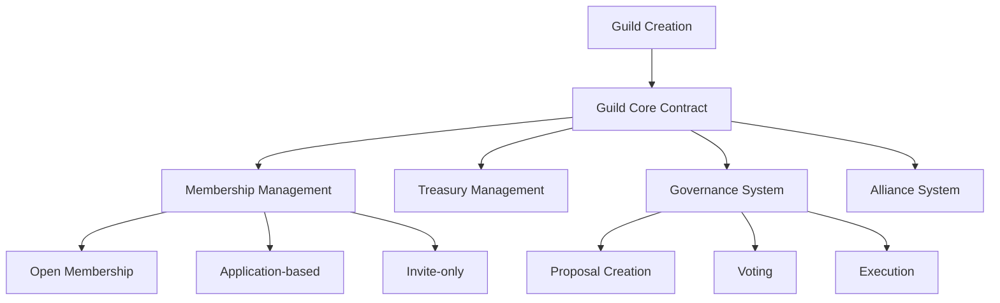

# ByteGuild Metaverse Platform

A decentralized platform for creating and managing virtual guilds in the metaverse, enabling collaboration, resource sharing, and collective governance on the Stacks blockchain.

## Overview

ByteGuild enables users to:
- Create and join virtual guilds with customizable membership criteria
- Contribute to guild treasuries and participate in collective decision-making
- Form alliances between guilds and manage shared resources
- Execute on-chain governance through proposal creation and voting

The platform is designed for communities, gaming clans, DAOs, and any group seeking to organize themselves in the metaverse with transparent, decentralized governance.

## Architecture

The ByteGuild platform is built around a core smart contract that manages all guild-related functionality:



## Contract Documentation

### byteguild-core.clar

The main contract handling all guild functionality.

#### Key Features
- Guild lifecycle management
- Membership control systems
- Treasury management
- Governance and voting
- Inter-guild alliances

#### Access Control
- Guild founders have special privileges for guild management
- Different membership types (Open, Application, Invite-only)
- Proposal execution restricted to founders
- Member-only functions for voting and contributions

## Getting Started

### Prerequisites
- Clarinet
- Stacks wallet

### Installation
1. Clone the repository
2. Install dependencies
```bash
clarinet install
```
3. Test the contracts
```bash
clarinet test
```

## Function Reference

### Guild Management

```clarity
(create-guild (name (string-ascii 50)) (description (string-utf8 500)) (membership-type uint))
```
Creates a new guild with specified parameters.

```clarity
(update-guild (guild-id uint) (name (string-ascii 50)) (description (string-utf8 500)) (membership-type uint))
```
Updates existing guild details (founder only).

### Membership

```clarity
(join-guild (guild-id uint))
```
Join an open membership guild.

```clarity
(apply-to-guild (guild-id uint) (statement (string-utf8 200)))
```
Apply to join an application-based guild.

```clarity
(invite-to-guild (guild-id uint) (invitee principal))
```
Invite a user to join an invite-only guild.

### Treasury

```clarity
(contribute-to-treasury (guild-id uint) (amount uint))
```
Contribute STX to guild treasury.

### Governance

```clarity
(create-proposal (guild-id uint) (title (string-ascii 100)) (description (string-utf8 1000)) (duration uint) (action-data (optional (buff 1024))))
```
Create a new governance proposal.

```clarity
(vote-on-proposal (guild-id uint) (proposal-id uint) (support bool))
```
Vote on an active proposal.

## Development

### Local Testing
```bash
# Run all tests
clarinet test

# Deploy contracts locally
clarinet console
```

### Contract Deployment
1. Build the contract
```bash
clarinet build
```
2. Deploy using the Stacks CLI
```bash
stx deploy_contract
```

## Security Considerations

### Limitations
- Proposal execution is manual and requires founder intervention
- Treasury limited to STX tokens initially
- No delegation of voting power

### Best Practices
- Always verify guild existence and membership before operations
- Check proposal status and expiration before voting
- Validate all parameters in public functions
- Use appropriate error codes for better error handling